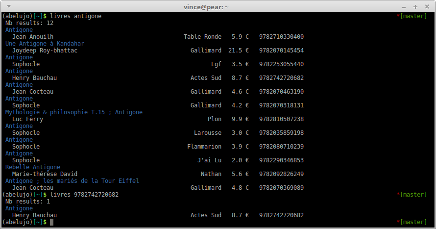

# Web scraping to get book information

This library is to get book information. We can search with **keywords**,
with the **isbn**, with an **advanced search**, and do **pagination**.

We get the data from existing websites. We scrape:

- for French books, http://www.librairie-de-paris.fr (also Decitre, but it's less complete)
- for Spain: http://www.casadellibro.com
- for Germany: http://www.buchlentner.de

we get: the title and authors, the price, the publisher(s), the cover, etc

## Import data from an ods or csv file

Another goal of this lib is to easily fetch a large amount of books
you have listed in an ods or csv file.

If your file has an 'isbn' and a 'quantity' column, it's easy, we will
find all the book information.

If it only has the title and the publisher, it's doable but error prone. We
can still do it, but you shall do an inventory of your stock
afterwards.

See the ``odsimport`` module. It gives back a json. It's your
responsibility to add what you want in your database (this is done in
Abelujo https://gitlab.com/vindarel/abelujo).

Usable, but work in progress.

### Accepted format and columns

We can read ods and csv files.

- a file with an "isbn" and "quantity" column,
- a file with columns "title", "publisher", "isbn" (optionnal in this
  case), "shelf", "distributor", "quantity". There is **no** "price"
  column. "authors" is optionnal (it can help to fetch the correct
  book).

If the file has no headers, use the "odsettings.py" configuration file
(in particular, to set the csv delimiter, either "," or ";").

## Why not Amazon ?

Amazon kills the book industry and its employees.  But moreover, we
can add value to our results. We can link to a good and independent
bookshop from within our application, we could command books from it,
we could say if it has exemplaries in stock or not, etc. And… we learn
a lot in doing this !

Technically speaking, the Amazon API web service can be too limitating
and not appropriate. One must register to Amazon Product Advertising
and to AWS, and the requests rate is limited to 1 request per second.

## Why not Google books ?

It has very few data.

## Why not the BNF (Bibliothèque Nationale de France) ?

Because, for bookshops, we need recent books (they enter the BNF
database after a few months), up to date information. There isn't a
lot of tools either.

# Install

Install from pypi:

    pip install bookshops

# Use

## Command line

You can try this lib on the command line with the following commands:
- `livres`: french books
- `libros`: spanish books
- `bucher`: german books
- come and ask for more :)

For example:

    livres antigone

or

    livres 9782918059363

and you get the above screenshot.

**Options**: (this may vary according to the scrapers, check them with `-h`)
- `-i` or `--isbn` to ensure to get all the isbn. The command line
  tool won't get them by default if they need to be fetched with
  another http request for each book. That depends on the websites.

## As a library

But most of all, from within your program:

    from bookshops.frFR.librairiedeparis.librairiedeparisScraper import Scraper as frenchScraper

    scraper = frenchScraper("search keywords")
    cards = scraper.search()
    # we get a list of dictionnaries with the title, the authors, etc.

## Advanced search

Work in progress.

You can search ``ed:agone`` to search for a specific publisher.

## Pagination

We do pagination:

    scraper = frenchScraper("search keywords", PAGE=2)

# Develop and test

See http://dev.abelujo.cc/webscraping.html

Development mode:

    pip install -e .

Now you can edit the project and run the development version like the
lib is meant to be run, i.e. with the `entry_points`: `livres`,
`libros`, etc.

doc: https://python-packaging-user-guide.readthedocs.org/en/latest/distributing/#working-in-development-mode

# Bugs and shortcomings

This is webscraping, so it doesn't go without pitfalls:

- the site can go down. It happened already.
- the site can change, it which case we would have to change our
  sraper too. This can be catched early with automated and frequent
  tests (work ongoing).

We use multiprocessing to speed up scrapers (see
[issue #1](https://gitlab.com/vindarel/bookshops/issues/1)).

# Licence

LGPLv3
